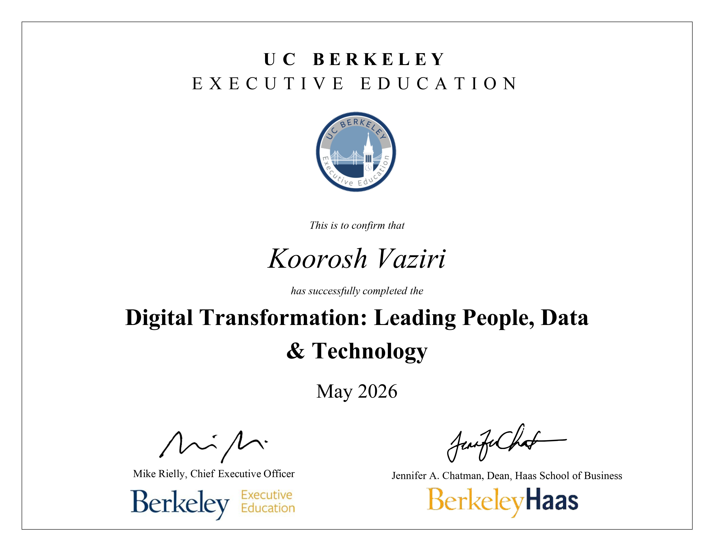

# 🌐 Berkeley Digital Transformation: Leading People, Data & Technology
### UC Berkeley Haas School of Business — Executive Education

This repository houses the projects, frameworks, and strategic notes compiled during the **Digital Transformation: Leading People, Data, and Technology** program at UC Berkeley Haas. The curriculum focuses on architecting data-driven business models, mitigating organizational inertia, and managing the technological disruptions reshaping modern enterprise.

## 🎯 Executive Core Competencies
- **Process Optimization & Mapping:** Utilizing **Swimlane process mapping** to deconstruct and re-engineer complex workflows, stripping away operational friction, and accelerating cross-functional feature velocity.
- **Strategic Data Analytics:** Designing platform mechanics, identifying data moats, and leveraging predictive/prescriptive data modeling to maximize the ROI of engineering efforts.
- **Change Management & Culture:** Aligning human capital with technological evolution, overcoming systemic organizational resistance, and establishing high-impact KPIs to lead high-performance squads through digital transformation.

## 🔍 Framework Focus Areas

### 1. Data as a Strategic Asset
- Transitioning organizations from static data publishers to dynamic interactive platforms.
- Utilizing analytics and customer telemetry as predictive assets for long-term platform lock-in and multi-sided network effects.

### 2. Technology & Structural Architecture
- Moving beyond isolated IT infrastructure to weave technology as a permanent dimension of business operations.
- Evaluating the deployment of cutting-edge tech stacks against real-world business constraints and organizational scalability.

### 3. People, Culture & Alignment
- Unraveling rigid departmental silos to rebuild user-centric, agile frameworks.
- Navigating the legal, ethical, and societal complexities of digital scaling, including algorithmic bias and data governance.

---

### 🎓 Professional Certification

*UC Berkeley Digital Transformation Certificate: Leading People, Data, and Technology*
